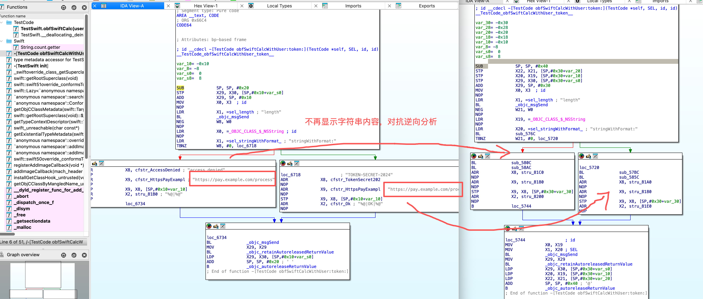
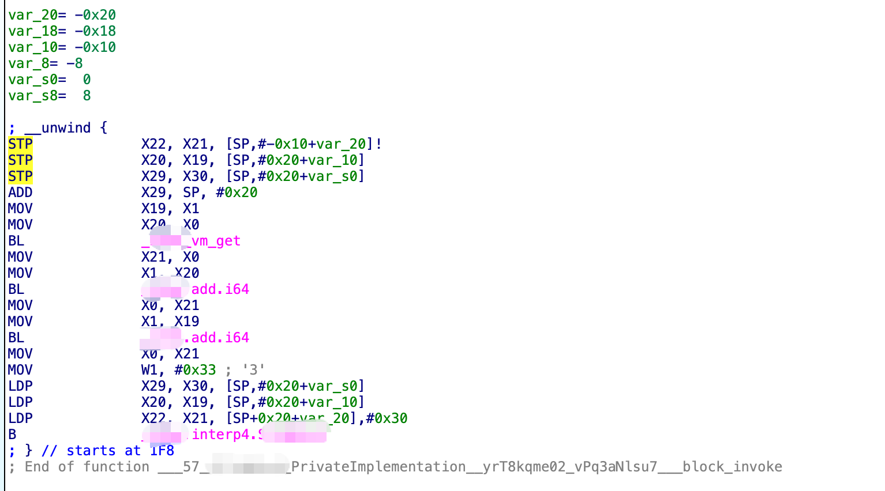

# iGuard - iOS SDK 源码加固

> 基于虚拟机技术的下一代代码保护方案

[中文](README.md) | [English](README_EN.md)

针对 iOS SDK 源码进行深度混淆、加固，使用独创的虚拟机技术对代码进行加密保护，提高逆向、破解难度。保护您的核心业务逻辑和知识产权。

**联系邮箱：** [support@anti.xin](mailto:support@anti.xin)

---

## 核心功能

### 🔀 代码逻辑混淆

通过将原始代码的控制流进行切分、打乱、隐藏，或在函数中插入花指令来实现对代码的混淆，使代码逻辑复杂化但不影响原始代码逻辑。控制流图变得十分复杂，包含大量不会被执行到的无用代码块，以及相互间的逻辑跳转，逆向分析难度大幅提升。

### 🔐 字符串加密

对代码中的字符串字面量进行加密处理，在运行时动态解密。即使使用 IDA Pro、Hopper 等工具进行反编译，也无法直接看到明文字符串，有效防止关键信息泄露，如 API 密钥、业务逻辑标识等敏感字符串。

### 🛡️ 代码虚拟化保护 (VMP)

**（仅支持 Xcode 12 版本）**

使用独创的虚拟机技术，将原生代码转换为虚拟指令集，通过专用解释器执行。配合随机化和加密机制，使得逆向分析变得极其困难。即使使用专业的反编译工具，也只能看到解释器层面的代码，而无法还原原始逻辑。

---

## 源码示例

<details>
<summary>点击查看源码</summary>

```objc
- (NSString *)obfSwiftCalcWithUser:(NSString *)user token:(NSString *)token {
    // xse：字符串加密
    NSString *url = @"https://pay.example.com/process";
    NSString *key = @"TOKEN-SECRET-2024";
    NSString *msg = @"access denied";

    // sub：算术与位运算密集
    uint32_t mix = ((uint32_t)(0 * 4)) ^ 0xFFFFFFFFU;
    mix = mix ^ ((uint32_t)(token.length * 97)) ^ 0x5A5A3C3CU;
    
    // obf/level：分支混合
    if ((mix % 2) == 0) {
        return [NSString stringWithFormat:@"%@|OK|%@", url, key];
    } else {
        return [NSString stringWithFormat:@"%@|%@", url, msg];
    }
}
```

</details>

---

## 原始 Mach-O

### 原始 Mach-O（IDA）截图


*展示未加固的 Mach-O 在 IDA 中的反编译效果，作为基线参考。*

---

## 保护效果展示

使用 IDA Pro 反编译分析，直观展示加固后的保护效果。

### 控制流图

**加固后（混合展示）**


*混合展示包含多种控制流改写方式（平坦化、虚假分支、替换、隐藏等），整体结构复杂且难以还原。*

### 反编译代码

**加固后**


*反编译代码被严重混淆，包含大量无用指令和复杂跳转，字符串被加密，无法直接理解代码逻辑。*

### 字符串

**加固后**



*敏感字符串被加密处理，字符串列表中无法直接看到明文，只有在运行时才会动态解密。*

### VMP 保护

**VMP 保护后**



*使用虚拟机保护 (VMP) 技术后，原始代码被转换为虚拟指令集。即使使用 IDA Pro 等专业反编译工具，也只能看到解释器层面的代码，而无法还原原始的业务逻辑。代码被完全虚拟化，逆向分析变得极其困难。*

---

## 使用说明

手动加固服务，专业团队为您提供定制化保护方案。

### 📧 联系邮箱

**support@anti.xin**

请发送邮件至上述邮箱，我们的技术团队将在 24 小时内与您联系，为您提供专业的加固服务。

### 服务流程

#### 1. 准备源码

**重要：必须提供完整的源代码**。将需要加固的 iOS SDK 源码组织为独立的 Framework 工程。建议使用 C/C++ 编写核心代码，以获得最佳的加固效果和稳定性。我们无法对已编译的二进制文件进行加固。

#### 2. 发送邮件申请

发送邮件至 **support@anti.xin**，邮件中请包含：项目简介、需要加固的代码范围、Xcode 版本信息、联系方式等。我们的技术团队会评估您的需求并提供加固方案。

#### 3. 提供源码

确认加固方案后，请提供完整的源代码工程。我们会在安全的环境中进行加固处理，确保您的代码安全。加固完成后，我们会提供加固后的 Framework 和验证报告。

#### 4. 验收测试

收到加固后的 Framework 后，请进行完整的功能测试，确保所有功能正常工作。我们也会提供 IDA Pro 反编译对比报告，展示加固效果。

### 服务要求

- ✅ **必须提供完整源代码**，不支持仅提供二进制文件
- ✅ 支持 Xcode 14.1/14.2/15.0.1/15.3/15.4
- ✅ 支持 X86/M1 架构 Mac
- ✅ 建议使用 C/C++ 编写核心代码
- ✅ 工程路径不能包含空格或中文
- ✅ 使用 New Build System
- ⚠️ 不支持对整个 App 进行加固，建议只加固核心 Framework
- ⚠️ 仅支持手动加固服务，不提供自动化工具

> **⚠️ 重要提示**  
> 本服务仅支持手动加固，需要您提供完整的源代码。我们无法对已编译的二进制文件进行加固处理。请确保您拥有源代码的完整权限，并同意我们使用源代码进行加固处理。

---

## 技术优势

基于编译时深度代码保护技术。

| 特性 | 说明 |
|------|------|
| 🔧 **编译时保护** | 在编译阶段进行代码转换和保护，不影响运行时性能 |
| 🎲 **随机化机制** | 每次编译使用不同的保护策略和映射关系，增加逆向难度 |
| 🔒 **多层加密** | 采用多层加密机制，防止静态分析和动态调试 |
| 🌉 **智能兼容** | 自动处理与外部系统的交互，保持完整的功能兼容性 |
| ⚡ **性能优化** | 针对核心代码进行保护，最小化性能影响，保持 SDK 的高效运行 |
| 🔄 **版本兼容** | 支持多个 Xcode 版本，确保在不同环境下稳定运行 |

---

## VMP 保护原理

虚拟机保护 (VMP) 技术详解。

### 保护流程

```
📝 源码编译
  ↓
原始代码编译为中间表示
  ↓
🔄 代码转换
  ↓
将代码转换为虚拟指令集
  ↓
🎲 随机化处理
  ↓
应用随机化策略，生成唯一保护方案
  ↓
🔐 加密处理
  ↓
对虚拟指令和解释器进行加密，嵌入到二进制
  ↓
▶️ 运行时执行
  ↓
解释器解密并执行虚拟指令
```

### VMP 架构示意图


---

## 联系方式

**邮箱：** [support@anti.xin](mailto:support@anti.xin)

---

<p align="center">
<small>&copy; 2026 iGuard SDK 加固解决方案. 保护您的代码，守护您的知识产权.</small>
</p>
